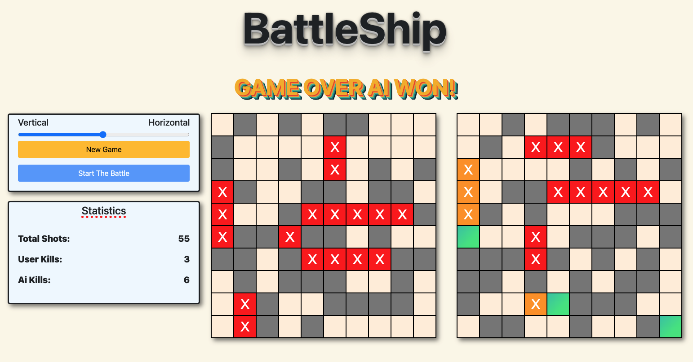
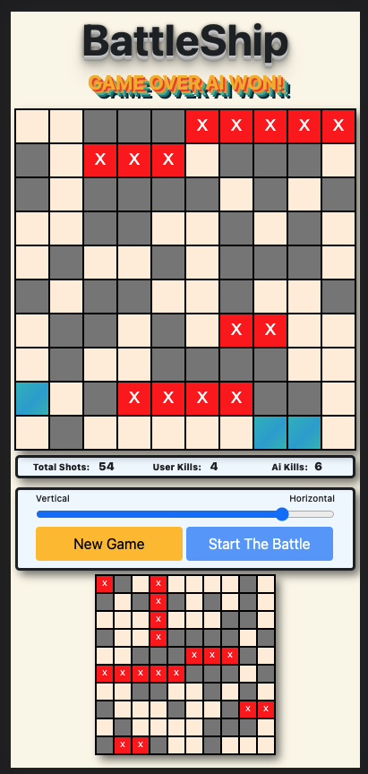

# 
 BattleShip  

## 
 [Play The Game](https://battle-ships2.netlify.app) 

---

## Description

Battleship (also known as Battleships or Sea Battle) is a strategy type guessing game for two players. It is played on ruled grids on which each player's fleet of warships are marked. The locations of the fleets are concealed from the other player. Ship sizes are 1, 2, 2, 3, 4, 5.

## Technologies

This application uses [JavaScript](https://developer.mozilla.org/), [JQuery](https://api.jquery.com/), [Bootstrap](https://getbootstrap.com/) and [Animista](https://animista.net/).

## Table of Contents:

- [Installation](#installation)
- [Usage](#usage)
- [License](#license)
- [Contributing](#contributing)
- [Questions](#questions)

## Installation:

To run locally:

- Just open index.html and enjoy the game.

## Usage:

* On the page you can generate your battleships randomly and choose the orientation.
* Click Start The Battle button and game will begin.
* Click on the boart to make the first shot.
* AI will play randomly until it finds a ship.
* After damaging a ship AI will start hitting all possible (4 if available) directions to find ship orientation (vertical or horizontal).
* After second successful hit AI will determine ship orientation and follow ship direction to destroy it.
* After destroying ship it will start hitting randomly to find another ship.
* After destroying opponents ships (total of 6) Game Over message will show up and winner will be announced.
* You can reset the game by pressing New Game button.
* Game is optimazed for desktop and mobile.

  

## License:

Licensed under the [MIT](https://opensource.org/licenses/MIT) license.

## Contributing:

Feel free to contact me to contribute to this project. My contact information is listed below.

## Questions:

## Contact me:    
